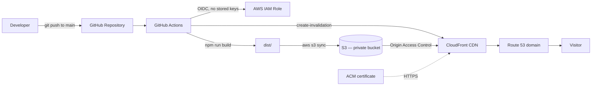

# Static Website CI/CD Pipeline — Personal Portfolio

A personal portfolio website with a fully automated deployment pipeline. Every push to `main`
builds the site and ships it to AWS — no manual steps, no long-lived credentials.

🔗 **Live demo:** 


## Overview

This project takes a static React site from a Git commit to a live, globally cached, HTTPS
website with a single `git push`. It was built to practise a production-style AWS deployment
workflow end to end, with security and automation as first-class concerns rather than
afterthoughts.

## Architecture



The S3 bucket stays fully private; CloudFront is the only entry point, reading from the bucket
through Origin Access Control (OAC). Deployment credentials are issued on demand via GitHub's
OIDC provider, so no AWS access keys are ever stored in the repository.

## Tech stack

| Layer        | Technology                                  |
| ------------ | ------------------------------------------- |
| Frontend     | React, Vite                                 |
| Hosting      | Amazon S3 (private)                          |
| CDN / HTTPS  | Amazon CloudFront + AWS Certificate Manager |
| DNS          | Amazon Route 53                             |
| CI/CD        | GitHub Actions                              |
| Auth         | GitHub OIDC → AWS IAM Role                   |

## What this project demonstrates

- Hosting a static site securely behind a private S3 bucket + CloudFront OAC, not a public bucket.
- A complete CI/CD pipeline that builds, deploys, and invalidates the CDN cache automatically.
- Keyless authentication to AWS using GitHub OIDC and a least-privilege IAM role — no secrets in the repo.
- HTTPS on a custom domain via ACM and Route 53 alias records.
- A branch-based Git workflow with pull requests.

## CI/CD pipeline

On every push to `main`, GitHub Actions:

1. Checks out the code and installs dependencies with `npm ci`.
2. Builds the production bundle with `npm run build`.
3. Assumes a scoped AWS IAM role through OIDC (no static credentials).
4. Syncs `dist/` to the S3 bucket with `--delete` to remove stale files.
5. Creates a CloudFront invalidation so visitors get the latest version.

See [docs/cicd-guide.md](docs/cicd-guide.md) for the full breakdown.

## Local development

```bash
npm install
npm run dev      # http://localhost:5173
npm run build    # outputs to dist/
```

## Deployment

The AWS infrastructure (S3, CloudFront, Route 53, ACM, IAM/OIDC) is set up once by hand,
then deployment is automatic. Full reproducible steps are in
[docs/deployment-guide.md](docs/deployment-guide.md).

## Project structure

```
static-website-cicd/
├── .github/workflows/deploy.yml   # CI/CD pipeline
├── docs/                          # architecture & guides
├── public/
├── src/
├── index.html
├── package.json
└── vite.config.js
```

## Documentation

- [Architecture](docs/architecture.md) — components and the reasoning behind each choice
- [Deployment guide](docs/deployment-guide.md) — set up the AWS infrastructure from scratch
- [CI/CD guide](docs/cicd-guide.md) — how a push becomes a live deploy

## License

MIT
